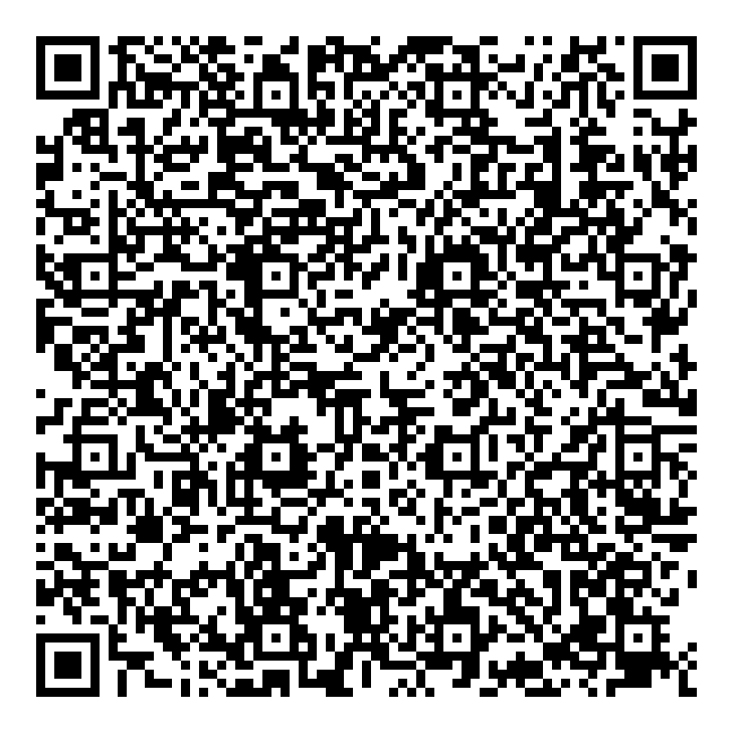

# 💳 Password-Protected Bank QR Generator

### 🏦 Project Title
**QR Bank Details Generator — Generate and Share Password-Protected QR Codes Containing Bank/UPI Details**

---

## 🧾 Overview

This project allows users to **securely share bank or UPI details** by generating a **QR code** and protecting it with a **password-encrypted ZIP file**.  
It ensures that sensitive financial details remain private, allowing the QR to be safely shared via email, WhatsApp, or other platforms.

> ⚙️ This is a **Python-based backend project** — it doesn’t run online on GitHub.  
> You can **clone and run it locally** using Python 3.8+.

---

## 🎯 Objectives

- Collect user’s bank details securely through command-line input.  
- Generate a **QR code** representing those details.  
- Store the QR code inside a **password-protected ZIP** for secure sharing.  
- Remove the original QR image after encryption for added safety.

---

## 🧩 Technologies Used

| Category | Technology / Library | Purpose |
|-----------|----------------------|----------|
| **Programming Language** | Python 3.8+ | Core logic |
| **QR Code Generation** | `qrcode` | Create QR image from bank/UPI data |
| **Image Handling** | `Pillow (PIL)` | Save QR image |
| **File Encryption** | `zipfile` | Create password-protected ZIP |
| **Secure Input** | `getpass` | Hide password input on screen |
| **File Management** | `os` | Manage file creation and deletion |

---

## ⚙️ Workflow Overview

```

User Input (Bank Details)
│
▼
QR Code Generation
│
▼
Password-Protected ZIP Creation
│
▼
ZIP Shared Securely (WhatsApp / Email)
│
▼
Receiver Extracts and Scans QR

````

---

## 🧮 Step-by-Step Usage Guide

### 🪶 1. Clone the Repository
```bash
git clone https://github.com/sakthi8125/QR_Bank_Details_generator.git
cd QR_Bank_Details_generator
````

### 🪶 2. Install Dependencies

```bash
pip install -r requirements.txt
```

> Or manually install:

```bash
pip install qrcode Pillow
```

---

### 🪶 3. Run the Script

```bash
python generate_qr.py
```

You’ll see prompts like this 👇
(Example based on your actual run)

```
==============================================
🔐 PASSWORD-PROTECTED BANK QR GENERATOR
==============================================

👤 Enter Account Holder Name: sakthidevi
🏦 Enter Bank Name: sbi
🔢 Enter Account Number: 1234567890
🏷️  Enter IFSC Code: SBIN0001234

💾 Select Account Type:
1. Savings
2. Current
3. Other
Enter choice (1/2/3): 1

🔐 Do you want to password-protect the QR file? (y/N): y
🔑 Enter password for ZIP protection: ****
🔑 Confirm password: ****
✅ Passwords match!

🧾 Formatted data:
Account Holder: sakthidevi  
Bank: sbi  
Account Number: 1234567890  
IFSC: SBIN0001234  
Type: Savings
```

---

### 🪶 4. QR and ZIP Generation

Then the program generates and encrypts the files:

```
🧾 Generated on: 2025-11-06 10:32:45
🔐 Secure QR Code - Keep this information safe!

📄 Generating QR code...
✅ QR code generated successfully: bank_qr_20251106_103245.png

📦 Creating password-protected ZIP...
🔐 Password-protected ZIP created: bank_qr_20251106_103245.zip
🗑️ Original PNG file removed for security: bank_qr_20251106_103245.png

🎉 GENERATION COMPLETE!
📁 Final file: bank_qr_20251106_103245.zip
⚠️ IMPORTANT: Remember your password - recovery is impossible!

💡 Security Tips:
• Store the file securely  
• Share passwords via secure channels  
• Regularly update your passwords
```

---

## 📦 Output Files

After successful execution, you will have:

| File                          | Description                               |
| ----------------------------- | ----------------------------------------- |
| `bank_qr_YYYYMMDD_HHMMSS.png` | Generated QR code (deleted after zipping) |
| `bank_qr_YYYYMMDD_HHMMSS.zip` | Final password-protected QR ZIP file      |

---

## 📸 Example Screenshots

### 🧩 Step 1 — User Input Details


### 🧾 Step 2 — QR Code Generation



### 🔐 Step 3 — Password-Protected ZIP Created


---

## 🧠 How to Redeem (Receiver Side)

The receiver will:

1. Receive the ZIP file (e.g. `bank_qr_20251106_103245.zip`).
2. Extract it using the correct password.

   * Windows: Right-click → Extract → Enter password
   * macOS/Linux: Use `unzip` or `7-Zip`
   * Or run this Python helper:

```python
# redeem_qr.py
import zipfile, getpass

zip_path = input("Enter ZIP filename (e.g. bank_qr_20251106_103245.zip): ")
pwd = getpass.getpass("Enter password to extract the QR: ")

with zipfile.ZipFile(zip_path, 'r') as zf:
    zf.extractall(pwd=pwd.encode('utf-8'))
    print("✅ Extraction successful. QR image saved in current folder.")
```

3. Open the extracted `bank_qr.png` in any QR scanner or UPI app to view the encoded bank details.

---

## 🧾 Example Encoded Data

When scanned, the QR reveals:

```
Account Holder: sakthidevi
Bank: sbi
Account Number: 1234567890
IFSC: SBIN0001234
Type: Savings
```

---

## ✅ requirements.txt

```
qrcode
Pillow
```

---

## 🧑‍💻 Author

**Developed by:**
🎓 *Sakthidevi*
Final Year – B.Sc. Computer Science with AI
Sathyabama Institute of Science and Technology

---

## 📜 License

This project is open-source under the **MIT License**.
You are free to use and modify this code for learning and development.

---

## 🌐 Tags

`#python` `#banking` `#security` `#fintech` `#upi` `#qr-code` `#studentproject`

```

---

✅ **Next Steps (Recommended for You)**
1. Upload all 3 screenshots to `screenshots/` folder.  
2. Add this updated `README.md` file to your repo root.  
3. Create a new file `requirements.txt` (with the 2 lines shown).  
4. Optionally add the helper `redeem_qr.py` file.

---

Would you like me to now create a **redeem_qr.py (complete, polished)** file that matches your generator’s style and prints user-friendly colored messages?
```
